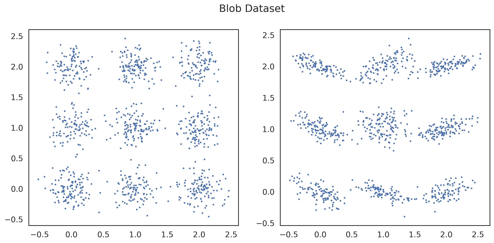

# deep-anytime-testing

1. Setup the environment and install packages
```
python3 -m venv my_env #  conda create --name my_env (if you use conda)
source my_env/bin/activate # conda activate my_env
pip install -r requirements.txt
```
We also recommend to install wandb for logging. See https://docs.wandb.ai/quickstart for more details. We use wandb for logging the training process and storing the test statistics.

2.Datasets
   
   **Blob Dataset**: The Blob dataset is a two-dimensional Gaussian mixture model with nine modes arranged on a 3 x 3 grid.  The two distributions differ in their variance as visualized in the figure below.


    
   **MNIST**: The MNIST dataset consists of hand-written digits.

   **CIFAR10**: The CIFAR10 dataset consists of 10 classes of images. We fine-tuned a ResNET50 model on the CIFAR10 dataset. We saved the model under data/cifar10/best_model.pth. It is used for generating adversarial samples with FGSM.
   
   **Gaussian CIT**: The Gaussian CIT dataset is a 20-dimensional hierachical Gaussian model used for the conditional independence test. 

   1. Structure
   
      train.py contains the training pipeline for each DAVT experiment. Here, all objects are initialized by making use of hydra's config files (see folder configs) and the training is performed. The training pipeline consists of the following steps:
        - **Initialize the data generator** (e.g. Blob dataset) This class yields samples from two distributions. The output object is of class torch.Dataset. Independently on the dataset there are two parameters that should be specified
          - samples: number of samples to be generated
          - type: type of the experiment "type2" (alternative holds) "type11" (null holds and the data comes from the first class), "type12" (null holds and the data comes from the second class)
        
          The configuration files for each data generator are in folder configs/data, e.g. the file blob.yaml contains
          ```
          _target_: "data.blob.BlobDataGen" # the class to be initialized
          samples: 1000 # mandatory parameter
          type: "type2" # mandatory parameter
          r: 3 # dataset specific parameter
          d: 2 # dataset specific parameter
          rho: 0.03 # dataset specific parameter
          with_labels: false # dataset specific parameter
          data_seed: 0 # dataset specific seed
          ``` 
        - **Initialize the operators.** An object of class Operator (operators/base/Operator). An example is the SwapOperator (operators/swap/SwapOperator) which swaps the last feature of the input. The operator is initialized with the following parameters 
          - swap operator: $\tau(x,y) = (y,x)$ and $\tau((x_1,y_1),(x_2, y_2)) = ((x_1,y_2),(x_2, y_1))$. As for the data generator the default initialization parameters for the SwapOperator (operators/swap/SwapOperator) are stored in a hydra config file: configs/operator/swap.yaml
            ```
            _target_: "operators.swap.SwapOperator"
            p: 3 # tau input dimension (e.g. the number of features in either x or y in the two-sample test or the total number of feature is x_1 and y_1 ( or x_2 and y_2))
            d: 2 # the starting index for swapping (e.g. here we swap the last feature of the 3D input) 
            ``` 
        - **Initialize the model.** The first model is a simple MLP with number and dimensions of hidden layers specified by the user. See the corresponding config files model/mlp.yaml for the default parameters. To build an MLP with four hidden layers with size 40 the user should specify hidden_layer_size: [40, 40, 40, 40].

        - **Initialize and perform the training** This step initializes a trainer object of class trainer.trainer.Trainer with configuration which can be specified in (configs/config.yaml)
   
      #### **Important:** The user should specify all needed parameters and store them in the configs/experiment/experiment.yaml file! An example (blob-swap-projection.yaml) is given below:
    ```
    # @package _global_
    defaults:
      - /data: blob # load the default parameters for the blob generator
      - /model: mlp # load the default parameters for the DNN model, here we use mlp
      - /operator@tau1: # load the default parameters for the first operator
          - projection
      - /operator@tau2: # load the default parameters for the first operator, the second operator is a composition \Tau_{swap}\circ\Tau_{proj}
          - swap
          - projection
    
    project: "Test" # project name for wandb
    
    tau1: # here you can overwrite the defaults for the first operator
      projection:
        input_dim: 0
    
    tau2: # here you can overwrite the defaults for the second operator
      swap:
        p: 2
        d: 0
      projection:
        input_dim: 0
    
    model: # here you can overwrite the defaults for the model
      input_size: 2
      hidden_layer_size: [30, 30]
      bias: true
    
    data:
      data_seed: 10
      samples: 90
      type: "type2"
      with_labels: false
    
    train: # you always need to specify the training parameters
      name: "davt" # this is important for the baseline training, see examples in 5.
      seed: 0 # seed for the training
      lr: 0.0005 # learning rate
      earlystopping: # early stopping parameters
        patience: 10
        delta: 0.0
      epochs: 500 # max number of epochs
      seqs: 30 # number of mini-batches
      T: 0 # Warm start number of mini-batches used for the training only
      alpha: 0.05 # significance level
      batch_size: 90 # batch size
      save: false # save the model, not implemented yet
      save_dir: ""
      l1_lambda: 0.0 # l1 regularization parameter
      l2_lambda: 0.0 # l2 regularization parameter
    ```

4. Experiments
With the following lines you can run each experiment for a single seed. For example, power experiments can be run with the following commands:
    ```
   # Blob dataset, type 2, DAVT swap,projection and DNN baselines
    python train.py experiment=blob-swap-projection data.type="type2" 
    python train_baselines.py experiment=blob-two-sample-baselines data.type="type2" train.name="deep"
   
    # Blob dataset, type 2, DAVT swap and DNN baselines
    python train.py experiment=blob-swap data.type="type11" # or type12
    python train_baselines.py experiment=blob-two-sample-baselines data.type="type11" train.name="deep"
   
    # CIFAR10 dataset, type 2, please specify the path to the model in the config file cifar10-aa-davt.yaml and cifar10-aa-baselines.yaml
    python train.py experiment=cifar10-aa-davt data.type="type2" 
    python train.py experiment=cifar10-aa-baselines train.name="deep" data.type="type2" 
   
   # CIT experiment, type 1
   python train.py experiment=gaussian-cit-davt data.type="type1" 
   python train.py experiment=gaussian-cit-baseline train.name="ecrt" # baseline ECRT
   
   # Rotated MNIST experiment, p=0.5
   python train.py experiment=mnist-rotation-davt data.p=0.5
   python train.py experiment=mnist-rotation-baselines train.name="rand" data.p=0.5 # baseline SC2ST with multiple testing corrections

        ```
If you want to run for several seeds use the run.ssh file.

To retrieve the results from wandb use the prepared notebooks in the folder notebooks.

5. Figures
The figures are generated with the notebook Plot-DAVT.ipynb in the folder notebooks with the data stored in the figures/data folder. The figures are stored in the folder figures.
